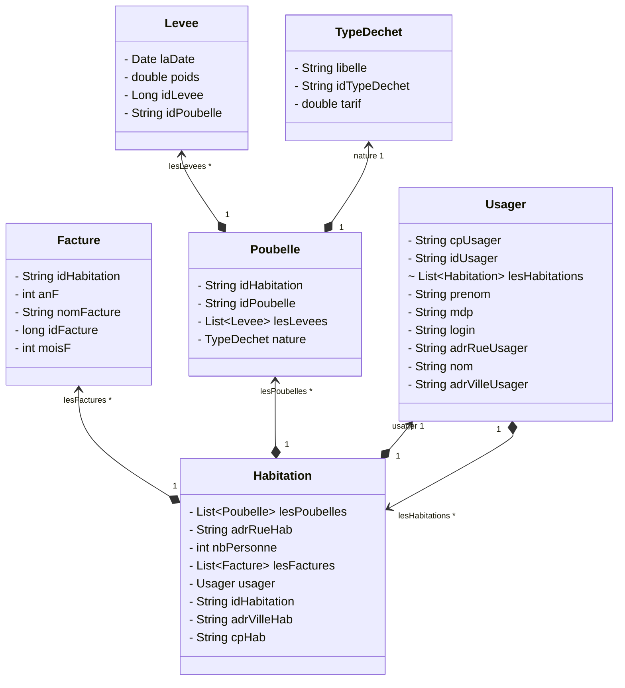

<!-- PROJECT LOGO -->
<br />
<div align="center">
  <a href="https://github.com/github_username/repo_name">
    
  </a>

<h3 align="center">TP API Spring Boot with Hybernate</h3>
<p align="center">
   <table>
       <tbody>
           <td align="center">
               <br>
               <i>Status:</i> Early Access</b> <br>
               <sup> Please report any issues 🐛</sup><br>
               <sub>Made possible by my <a href="https://github.com/sponsors/damchap">Sponsor Program 💖</a>
               <br>
           </td>
       </tbody>
   </table>
</p>
     <p align="center">
       <a href="https://github.com/damchap/APIGestionPoubelle">View Demo</a>
       ·
       <a href="https://github.com/damchap/APIGestionPoubelle/issues">Report Bug</a>
       ·
       <a href="https://github.com/damchap/APIGestionPoubelle/issues">Request Feature</a>
     </p>
   </div>


<!-- ABOUT THE PROJECT -->
## About The Project


### Project context

Project of the api of management of the dustbins for cities.

Project realized in the framework of courses on Spring boot.

### Built With

* [Spring Boot](https://spring.io/projects/spring-boot)
* [Hibernate](https://hibernate.org/)
* [H2 Database](https://www.h2database.com/html/main.html) for development environment

### Customer request / Course request

> Build an API of your choice with the spring boot framework and hibernate

Choose a concept about a soccer club, a city or other things, do not take the example made in class.
A mini API with three controllers, Ex: (Student, School, Classroom).
The CRUD method (Create, Retrieve, Update, Delete, List) for each controller.
A relationship between at least two tables (for example between Student and School as seen in the during the course) with the annotation @OneToMany.
A relationship between at least two tables, see @oneToOne, @ManyToMany in optional bonus points. Example of a tutorial that explains it well.
The model diagram of your database as the example in the course.


<!-- GETTING STARTED -->
## Getting Started

Project is based on Spring Boot and Hibernate, 

### Prerequisites

* Java 17
* IDE (IntelliJ, Eclipse, ...)
* Gradle
* API Client (Postman, Insomnia, ...)

### Installation

1. Clone the repo
   ```sh
   git clone https://github.com/damchap/APIGestionPoubelle.git
   ```
2. Open the project with your IDE
3. Run the project
4. Open your API Client and test the API
5. Enjoy
6. (Optional) You can change the port of the server in the application.properties file (default port is 8383) 
7. (Optional) You can change the database in the application.properties file (default database is H2)

<!-- USAGE EXAMPLES -->
## Usage

### API Documentation

https://github.com/damchap/APIGestionPoubelle/wiki/API-Documentation


<!-- LICENSE -->
## ➤ License

Distributed under the MIT License. See `LICENSE.txt` for more information.

## 🙇 Author
#### Damien Chapart
- Github: [@damchap](https://github.com/damchap)


<!-- ACKNOWLEDGMENTS -->
## Model Diagrams


